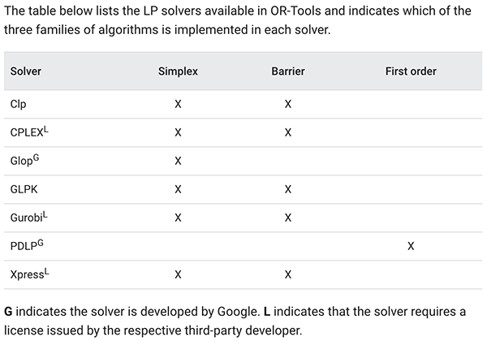

# Surface Winding Numbers

C++ demo for "[Winding Numbers on Discrete Surfaces](https://nzfeng.github.io/research/WNoDS/index.html)" by [Nicole Feng](https://nzfeng.github.io/index.html), [Mark Gillespie](https://markjgillespie.com/), and [Keenan Crane](https://www.cs.cmu.edu/~kmcrane/), presented at SIGGRAPH 2023.

Paper PDF (4.4mb): [link](https://nzfeng.github.io/research/WNoDS/WNoDS.pdf)

Project page with links to paper, pseudocode, supplementals, & videos: [link](https://nzfeng.github.io/research/WNoDS/index.html)

SIGGRAPH talk (10 minutes): [link](https://youtu.be/QnMx3s4_4WY)


If this code contributes to academic work, please cite as:
```bibtex
@article{Feng:2023:WND,
    author = {Feng, Nicole and Gillespie, Mark and Crane, Keenan},
    title = {Winding Numbers on Discrete Surfaces},
    year = {2023},
    issue_date = {August 2023},
    publisher = {Association for Computing Machinery},
    address = {New York, NY, USA},
    volume = {42},
    number = {4},
    issn = {0730-0301},
    url = {https://doi.org/10.1145/3592401},
    doi = {10.1145/3592401},
    journal = {ACM Trans. Graph.},
    month = {jul},
    articleno = {36}
}
```

# Getting started

## Running the program
```
git clone --recursive https://github.com/nzfeng/SWN.git
cd SWN
mkdir build && cd build
cmake -DCMAKE_BUILD_TYPE=Release ..
make -j8 # or however many cores you want to use
bin/main /path/to/mesh --c=/path/to/curve
```
A Polyscope GUI will open.

## Dependencies (linear program solvers)
The `main` branch of this repo relies on Gurobi to solve a linear program. While Gurobi has good performance, it is a commercial (not open source) solver (though free temporary licenses are available.) If you want to use Gurobi, see the section below. 

If 100% open-source code is a necessity, you may use the `open-source-lp` branch of this repo, which uses [OR-Tools](https://developers.google.com/optimization). OR-Tools is open-source software that includes wrappers around [several possible solvers](https://developers.google.com/optimization/lp/lp_advanced):



Install OR-Tools by following the OR-Tools documentation [here](https://developers.google.com/optimization/install/cpp). 

Which solver is used to solve the linear program will depend on what you have installed locally, and what command-line option you use. Full documentation on how to specify the solver is [here](https://github.com/google/or-tools/blob/stable/cmake/README.md). For instance, if you want to use COIN-OR's CLP solver, inside the `[project]/build` directory run
```
cmake .. -DUSE_COINOR=ON
```
before running `make`. See the documentation [linked above](https://github.com/google/or-tools/blob/stable/cmake/README.md) for the full list of command-line options for enabling solvers.

Finally, you must also specify the solver when running the executable, using a `--s` or `--solver` flag, for example
```
bin/main [path/to/mesh] --c=[path/to/curve] --s=CLP
```
The possible values (case-insensitive) are `CLP`, `CPLEX_LP`, `GLOP`, `GLPK_LP`, `GUROBI_LP`, `PDLP`, and `SCIP`, `XPRESS_LP`. By default, `SCIP` will be used.

### Gurobi
The `main` branch of this repo relies on Gurobi to solve a linear program, where you should first install [Gurobi](https://www.gurobi.com/). Those affiliated with an university can get the academic version for free. Otherwise, a free trial is available.

This project already has a `cmake` file to help CMake find your Gurobi installation, which lists several likely directories to look inside. However, if your installation is installed in a different place, you may need to change the path in Line 1 of `cmake/modules/FindGUROBI.cmake`. For example, here is the filepath to the Gurobi installation on my Mac:


Depending on which version of Gurobi you've installed, you may also need to add your version in line 9 -- for example, adding `gurobi 110` for version 11.0:


# Usage

You can pass several arguments to the command line, including some flags which are also shown in the GUI.

|flag | purpose|
| ------------- |-------------|
|`--c`, `--curve=input.txt`| Filepath to input curve. |
|`--o`, `--output=[meshname]_w.obj`| File to save winding number function to, consisting of the mesh along with homogeneous texture coordinates. |
|`--r`, `--approximateResidual`| Use reduced-size linear program to approximate the residual function, instead of solving a more expensive LP. Off by default. |
|`--V`, `--verbose`| Verbose output. |
|`--h`, `--headless`| Don't use the GUI, and automatically solve for & export the final winding number function. The GUI will be shown by default.|
|`--help`| Display help |
<!-- TODO: Expose all parameters -->

## File formats
The input mesh may be an `obj`, `ply`, `off`, or `stl`. See [the geometry-central website](https://geometry-central.net/surface/utilities/io/#reading-meshes) for up-to-date information on supported file types.

## Curve input
The curve may either be specified within the mesh file, or in a separate file which can be passed as a second command line argument.

If the curve is specified within the mesh file, the curve **must** be specified as [OBJ line elements](https://en.wikipedia.org/wiki/Wavefront_.obj_file#Line_elements). A line is specified by the character `l` followed by two or more vertex indices, which indicates that the curve includes an oriented edge between each pair of adjacent vertices. The curve can also be specified as a _dual 1-chain_, using the character `c` followed by two or more faces indices, which indicates that the curve jumps by +1 between each pair of adjacent faces. Using a dual 1-chain is usually not necessary; you might want to use a dual 1-chain only if the surface is non-orientable. **Note:** Since the dual version wasn't part of our original paper, supporting dual 1-chain input is still under construction at the moment.

If the curve is specified within a separate file, the curve **must** be specified using barycentric points along the surface. A barycentric point may either be of type "vertex" and specified in the form
```
v [vertex index]
```
or of type "edge",
```
e [edge index] [barycentric coordinate between 0 and 1]
```
Edges of the curve are specified by the character `l` followed by two or more indices of barycentric points -- where barycentric points are indexed according to their line order in the file -- indicating that the curve includes an oriented edge between each pair of adjacent barycentric points. Element indices and indices of barycentric points are by default 1-indexed following OBJ convention, but one may also include the directive `#offset 0` to use 0-indexing. See e.g. `data/annulus.txt` or `data/bunny-heart.txt` for examples of this file format. 

If some parts of the curve are not constrained to mesh edges, the mesh will be cut such that the curve conforms to the new, mutated mesh (but the curve geometry itself will remain unchanged.) The caveat is that the curve must initially be continuous and linear within each triangle face.

## Re-meshing

Depending on the curve input, the surface may need to be re-meshed for optimal output.

First, SWN is formulated for curves that conform to mesh edges. However, you can still specify curves generically as sequences of barycentric points along the surface, with the condition that the curve is continuous and linear within each triangle face. If this is the case, the surface will be re-meshed so that the curve lies entirely along mesh edges -- with no change to either the curve or mesh geometry. Only the number of edges/faces, and the connectivity of the mesh will change.

Second, since curve endpoints are omitted from the solve (Section 2.3.2 in the paper), curves that span only one mesh edge would be ignored. Therefore such edges are subdivided so that these parts of the curve will not be ignored.

## Intrinsic re-meshing

The GUI can perform intrinsic re-meshing for better numerical behavior. If you choose to solve on an intrinsic mesh, exporting the solution will export the solution on the [_common subdivision_](https://geometry-central.net/surface/intrinsic_triangulations/common_subdivision/) mesh.


Notes: 
* Only manifold meshes can be intrinsically re-triangulated.
* Delaunay refinement may not terminate with a minimum angle value >30 degrees. If this happens, I recommend picking an angle value of 25-28 degrees. Other times you may need to start with an even lower angle threshold, and gradually increase.

# Output

From the GUI menu, you can export the solution, as well as other intermediate functions, as an OBJ file containing both the mesh and texture coordinates. Whenever one calls an export function, the data that gets exported is from most recently computed solution.

From the GUI menu, you can also export curves as [OBJ line elements](https://en.wikipedia.org/wiki/Wavefront_.obj_file#Line_elements). In most 3D graphics software, how smooth a curve is rendered depends on its connectivity (i.e., there can be noticeable gaps between curves specified as separate segments.) Therefore, this program will automatically greedily compute the connected components of the curve before exporting, so that the curve can be written with maximum connectivity and hence yield maximum smoothness during rendering. I have included an example Blender file that loads in a mesh, and renders the winding number function stored as texture coordinates on the mesh; see the section on "Visualization" below.

## Homogenous texture coordinates

For better visualization of the solution around curve endpoints, we implemented a projective interpolation (see Figure 4 from the paper.) The Polyscope shader in this program is already set up to perform this special interpolation, so solutions will look already good in the GUI.

When you export a solution, we output texture coordinates for the mesh in _homogeneous coordinates_. To visualize these textures, the 2d coordinates are linearly interpolated across each triangle. Then, for each pixel the first coordinate is divided by the 2nd coordinate to obtain the final function value. This can be done in a shader, or via shader nodes in Blender -- see `Example.blend` for an example.

## Visualization

The `render/` directory contains an example Blender file (`Example.blend`) that can load and visualize meshes and curves, with the SWN solution. The Blender file should open to a Python script in the `Scripting` workspace. You can load your own mesh & solution (encoded as texture coordinates) by changing the mesh filepath in the script and clicking on `Run Script`. This will load your model and visualize the correctly-interpolated solution.


